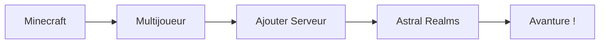

<CTA>
  Bienvenue sur Astral Realms, le wiki officiel du serveur Minecraft Semi-RPG français !
</CTA>

## 🌟 Qu'est-ce qu'Astral Realms ?

Astral Realms est un **serveur Minecraft survie semi-RPG français** avec une communauté bienveillante de 250+ joueurs actifs chaque jour.

<Callout type="info">
  <strong>Gratuit et accessible</strong> — Rejoignez l'aventure en moins de 2 minutes, sans mod requise !
</Callout>

### Une expérience unique

Explorez un univers où tout ce que vous faites a un impact sur l'économie du serveur. Affrontez des donjons épiques, construisez votre ville, commercez avec d'autres joueurs, et bien plus encore !

<CardGroup cols={2}>
  <Card title="🗡️ Donjons & Combats" icon="sword">
    
<strong>27 donjons uniques</strong> à explorer avec un système de classes dynamique. Tank, Heal, DPS — changez de classe en quelques secondes selon votre style de jeu.

  </Card>

  <Card title="🏘️ Villes & Construction" icon="home">
    
Construisez votre ville seul ou avec vos amis. Créez des champs immenses, des structures gigantesques, ou un petit coin cosy. Votre ville est votre sanctuaire sécurisé !

  </Card>

  <Card title="💰 Économie & Commerce" icon="coins">
    
Fermez tranquillement, montez vos métiers et vendez vos ressources. Une économie entièrement axée sur les joueurs pour enrichir votre expérience.

  </Card>

  <Card title="🤗 Communauté Bienveillante" icon="heart">
    
Profitez d'une expérience <strong>sans PvP</strong> où l'entraide est la clé. Personne ne peut vous attaquer ou vous piller — ici, on construit ensemble !

  </Card>
</CardGroup>

---

## 🚀 Comment nous rejoindre ?

Connectez-vous gratuitement sur Astral Realms en suivant ces étapes simples :

1. **Lancez Minecraft** (Version Java requise)
2. **Cliquez sur Multijoueur**
3. **Ajoutez un serveur** avec l'IP ci-dessous
4. **Connectez-vous** et commencez l'aventure !

<Mermaid />

<Callout type="success">
  <strong>IP du serveur :</strong> <code>play.astralrealms.fr</code>
</Callout>

<Note>
  <strong>Important :</strong> Le serveur est uniquement disponible en version Java. Les cracks ne sont pas autorisés — vous devez posséder une licence officielle Minecraft.
</Note>

---

## 📚 Explorer le Wiki

Toutes les informations dont vous avez besoin pour profiter au mieux de votre expérience sur Astral Realms.

<Columns cols={2}>

<Card
  title="Règlement du Serveur"
  icon="scroll"
  href="/rules/index"
  horizontal
>
  Consultez les règles à respecter pour une expérience agréable pour tous. Chat, gameplay, farms autorisées et sanctions.
</Card>

<Card
  title="Système de Ville"
  icon="building"
  href="/ville/introduction"
  horizontal
>
  Apprenez à créer et gérer votre propre ville, gérer les membres, la banque et les paramètres.
</Card>

<Card
  title="Farms Autorisées"
  icon="wheat"
  href="/rules/farms"
>
  Consultez la liste complète des farms autorisées et interdites sur le serveur.
</Card>

<Card
  title="Contribuer au Wiki"
  icon="git-pull-request"
  href="/contributing/index"
>
  Aidez-nous à améliorer la documentation en proposant vos modifications via GitHub.
</Card>

</Columns>

---

## 🎯 Pour qui est ce serveur ?

<Tabs>
  <Tab title="Nouveaux Joueurs">
    Que vous soyez nouveau sur Minecraft ou que vous n'ayez jamais joué sur un serveur auparavant, vous avez votre place dans le royaume d'Astral. Le jeu vous accompagne tout au long de votre aventure pour vous aider à comprendre intuitivement le nouveau monde qui vous entoure.
  </Tab>

  <Tab title="Vétérans de Minecraft">
    Découvrez un Minecraft poussé à son plein potentiel. Craft, enchantez, récoltez… Astral reste fidèle aux mécaniques du jeu de base pour ne pas le dénaturer. Brillez dans des combats dynamiques et stratégiques en donjon pour prouver votre valeur et vous faire une renommée.
  </Tab>
</Tabs>

---

## 💡 Questions Fréquentes

<AccordionGroup>
  <Accordion title="Est-ce qu'un reset est bientôt prévu ?" icon="calendar">
    Non, aucun reset n'est prévu pour le moment. Le serveur a ouvert le 20 Décembre 2025, et de nouvelles fonctionnalités sont régulièrement ajoutées. Arriver à la version finale d'Astral prendra du temps — la question du reset ne se pose même pas !
  </Accordion>

  <Accordion title="Est-ce que le serveur est disponible sur Bedrock ?" icon="help-circle">
    Non, vous pouvez seulement jouer à Astral Realms avec la version Java de Minecraft.
  </Accordion>

  <Accordion title="Est-ce que les cracks sont autorisés ?" icon="lock">
    Non, seules les personnes ayant acheté le jeu Minecraft peuvent se connecter.
  </Accordion>

  <Accordion title="Comment créer une ville ?" icon="home">
    Consultez notre page <a href="/ville/introduction">Introduction au système de ville</a> pour découvrir toutes les étapes !
  </Accordion>
</AccordionGroup>

---

## 🌐 Rejoindre la Communauté

<CardGroup>
  <Card title="Serveur Discord" icon="discord" href="https://discord.gg/astralrealms">
    Rejoignez 150+ joueurs pour discuter, obtenir de l'aide et participer aux événements communautaires.
  </Card>

  <Card title="Site Web" icon="globe" href="https://astralrealms.fr">
    Retrouvez toutes les informations sur le serveur, les mises à jour et les nouveautés.
  </Card>
</CardGroup>

<Callout type="info">
  <strong>Un problème ?</strong> N'hésitez pas à nous contacter sur Discord ou à consulter notre wiki pour trouver des réponses à vos questions.
</Callout>
